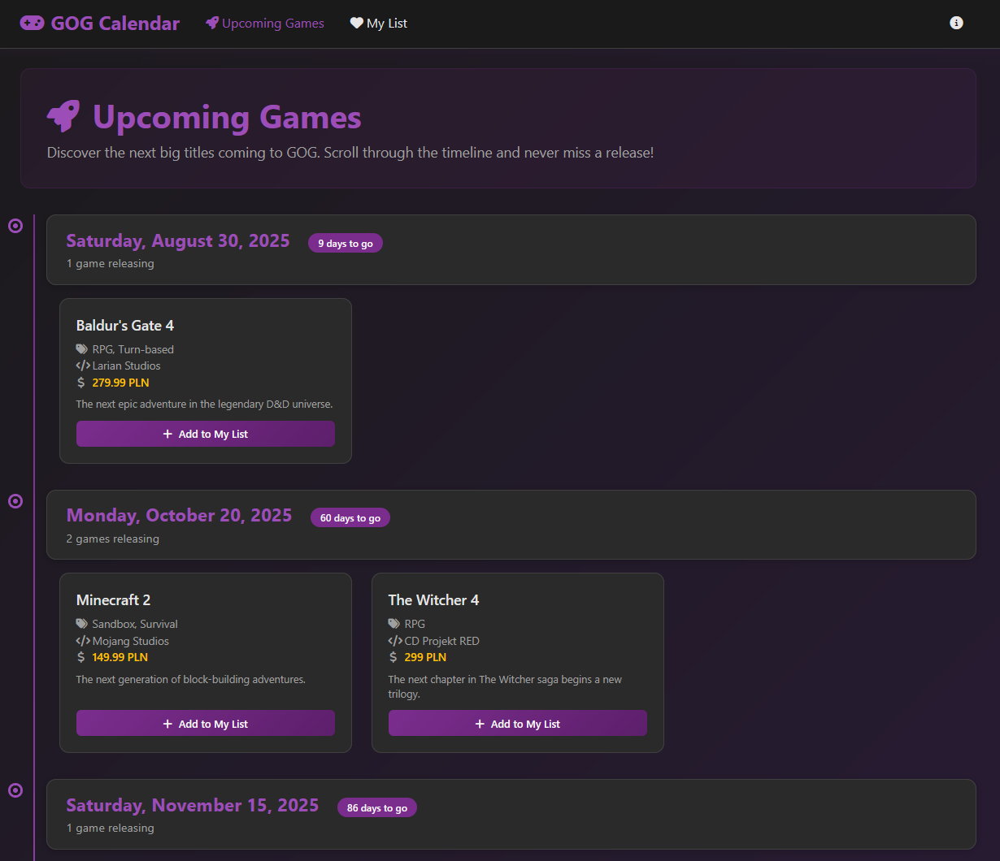
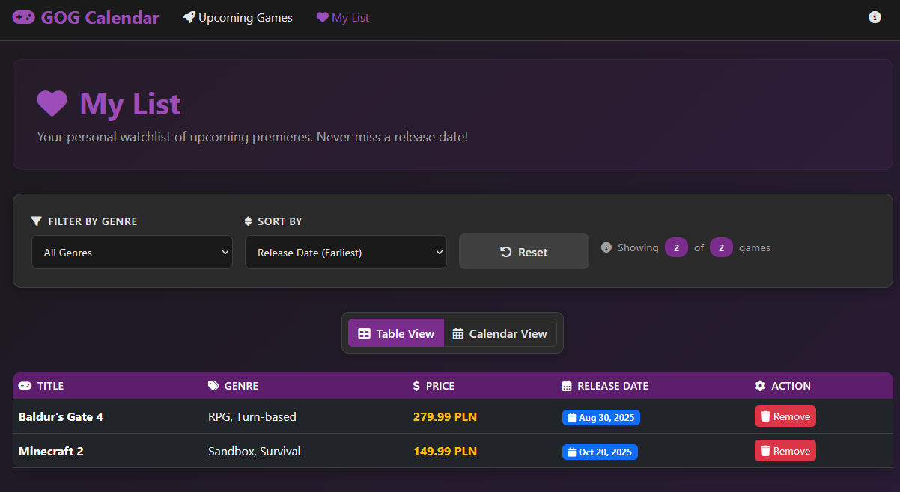
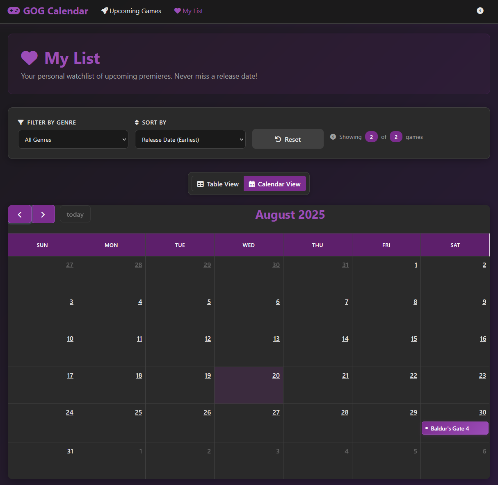

# GOG Calendar POC

## The Problem

While GOG.com is an excellent DRM-free gaming platform, for me it has one missing piece when it comes to tracking upcoming game releases. I like to use wishlist-type of features to track games I want to buy, but also to see what's coming soon.

## Current situation

- **No dedicated "Upcoming Games" section** - GOG only shows "New Releases" for games entering the platform, regardless of actual release dates
- **Limited wishlist sorting** - GOG's wishlist has no release date sorting capabilities
- **No calendar visualization** - There's no way to see release dates in a calendar format

## The Solution

This project creates a **Proof of Concept (POC)** that addresses this limitation by providing:

- **Timeline View** - Browse upcoming releases day-by-day
- **Personal Watchlist** - Add/remove games
- **Calendar Integration** - monthly calendar view for release dates

## Technical Stack:
- **Backend**: Symfony 6+ Framework, PHP 8+
- **Frontend**: Bootstrap 5, FullCalendar.js
- **Storage**: Session-based (enough for POC)

This project served as my **introduction to PHP development**.

## Screenshots

| Timeline View         | Personal Watchlist          | Calendar Integration         |
|-----------------------|-----------------------------|------------------------------|
|  |  |  |

